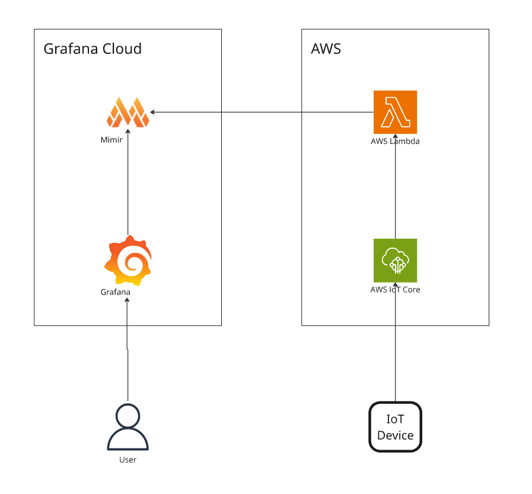
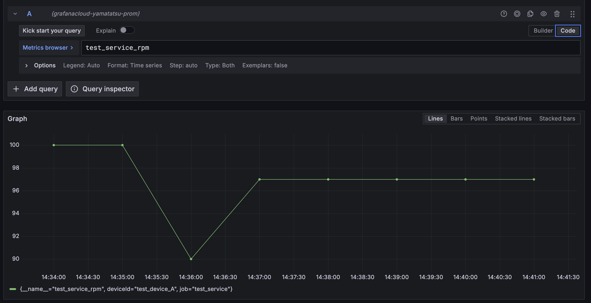

# MQTTで受け付けたIoTデータをLambda一本でGrafana Cloudに可視化する

## 概要

Grafana CloudはGrafana Labsが提供するフルマネージドGrafana環境です。
Grafana CloudではMimirという時系列データベースもホストされており、10,000メトリクスまで無料で利用できます。

このソリューションでは、AWS IoT CoreにMQTTで送信されたデータをGrafana Cloud上のMimirに保存します。
これにより、IoTデータの「とりあえず可視化してみる」を迅速に実現できます。

## アーキテクチャ



## ソースコード

### 全体
ソースコードは以下のリポジトリにあります。

https://github.com/yamatatsu/push-iot-metrics-to-grafana-mimir

AWS CDKによってAWSリソースを作成できるようにしています。
LambdaはTypeScriptで記述しています。

### CDKのソースコード

```ts
import * as iot from '@aws-cdk/aws-iot-alpha';
import * as iotActions from '@aws-cdk/aws-iot-actions-alpha';
import * as lambda from "aws-cdk-lib/aws-lambda";
import * as nodejs from "aws-cdk-lib/aws-lambda-nodejs";
import * as logs from "aws-cdk-lib/aws-logs";
import * as ssm from "aws-cdk-lib/aws-ssm";
import * as cdk from 'aws-cdk-lib';

// 簡易的な実装で失礼します。。。
const app = new cdk.App();
const stack = new cdk.Stack(app, 'PushIotMetricsToGrafanaMimirStack');

/** Lambda関数の定義 */
const fn = new nodejs.NodejsFunction(stack, 'Function', {
  entry: './src/app.Function.ts',
  runtime: lambda.Runtime.NODEJS_22_X,
  architecture: lambda.Architecture.ARM_64,
})
// SSMパラメータストアに対するアクセス許可
ssm.StringParameter
  .fromSecureStringParameterAttributes(stack, 'GrafanaOtelSecrets', {
    parameterName: '/grafana/otel/secrets',
    version: 1,
  })
  .grantRead(fn);

/** エラーログの定義 */
const errorLog = new logs.LogGroup(stack, "ErrorLog", {
  removalPolicy: cdk.RemovalPolicy.DESTROY,
});

/** MQTTのハンドリングについて定義 */
new iot.TopicRule(stack, 'TopicRule', {
  sql: iot.IotSql.fromStringAsVer20160323("SELECT * FROM 'PushIotMetricsToGrafanaMimir'"),
  actions: [new iotActions.LambdaFunctionAction(fn)],
  errorAction: new iotActions.CloudWatchLogsAction(errorLog),
});
```

### Lambdaのソースコード

```ts
import { getParameter } from "@aws-lambda-powertools/parameters/ssm";
import { ValueType } from "@opentelemetry/api";
import { OTLPMetricExporter } from "@opentelemetry/exporter-metrics-otlp-http";
import { MeterProvider, PeriodicExportingMetricReader } from "@opentelemetry/sdk-metrics";
import { resourceFromAttributes } from "@opentelemetry/resources";
import { ATTR_SERVICE_NAME } from "@opentelemetry/semantic-conventions";
import * as v from 'valibot';

/** MQTTのペイロードのスキーマ */
const mqttPayloadSchema = v.object({
  deviceId: v.string(),
  label: v.string(),
  value: v.number(),
});

/** パラメーターストアに保存したJSONのスキーマ */
const secretSchema = v.object({
  endpoint: v.string(),
  token: v.string(),
});

export const handler = async (event: unknown) => {
  /** MQTTのスキーマ確認 */
  const payload = v.parse(mqttPayloadSchema, event);

  /** パラメーターストアから秘密情報を取得 */
  const rawSecret = await getParameter("/grafana/otel/secrets", {
    transform: "json",
    decrypt: true,
    maxAge: 10 * 60, // seconds
  });
  const secret = v.parse(secretSchema, rawSecret)

  // OpenTelemetryを用いたデータ送信処理

  const meterProvider = new MeterProvider({
    resource: resourceFromAttributes({
      [ATTR_SERVICE_NAME]: "test_service",
    }),
    readers: [
      new PeriodicExportingMetricReader({
        exporter: new OTLPMetricExporter({
          /**
           * OTELエンドポイント(`https://${host}/otlp`)に加えて、
           * MimirのAPIリファレンスに記載されているOTELのpath(`/otlp/v1/metrics`)を合わせて指定する
           * @see https://grafana.com/docs/mimir/latest/references/http-api/#otlp
           */
          url: `${secret.endpoint}/v1/metrics`,
          headers: {
            Authorization: `Basic ${secret.token}`,
          },
        }),
        exportIntervalMillis: 1000,
      }),
    ],
  });
  const meter = meterProvider.getMeter("test", "1.0.0");

  const inputGauge = meter.createGauge(`test_service_${payload.label}`, {
    valueType: ValueType.DOUBLE,
  });

  inputGauge.record(payload.value, {
    deviceId: payload.deviceId,
  });

  await meterProvider.shutdown();
}
```

## 動作

```bash
# デプロイ
pnpm cdk deploy

# awsコマンドを用いて擬似的にMQTTデータを送信
aws iot-data publish \
  --topic="PushIotMetricsToGrafanaMimir" \
  --payload='{"deviceId": "test_device_A","label": "rpm","value": 101}' \
  --cli-binary-format=raw-in-base64-out
```

結果:



## 注意点

#### データの保存期間

- Grafana Cloudの無料プランではMimirのデータ保存期間は14日間です。
- 有料プランでも保存期間は13ヶ月固定です。

分析用途やアプリケーション用途でデータを使用する場合、それぞれS3やDynamoDBなどにデータを保存することをお勧めします。

#### 料金（2025/04/07時点）

Grafana Cloudの無料プランは期限なく利用できます。

Proプランでは、料金はメトリクスの量とメトリクス内のデータポイントの密度によって変動します。

- メトリクスはDPM(Data Points per Minute)という単位でカウントされます。
  - 1分あたり1サンプルを保存する場合、1 DPMとなります。
  - 1分あたり6データポイントを保存する場合、6 DPMとなります。
- 10,000 DPMまで追加の料金はありません
- 10,000 DPM以降、1,000 DPMあたり1ドル/月

参考: https://grafana.com/docs/grafana-cloud/cost-management-and-billing/understand-your-invoice/metrics-invoice/

## おわりに
